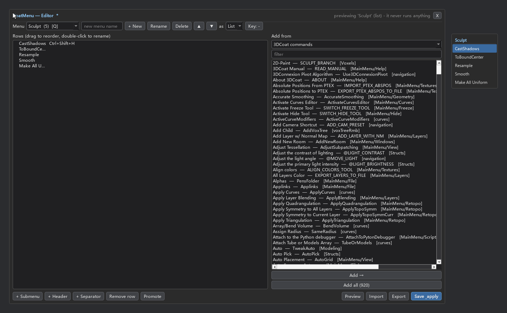

# CoatMenu

> Custom pop-up action menus for **3D-Coat** — at the cursor, from a hotkey.

CoatMenu is the 3D-Coat sibling of [Krita **MenuBelt**](https://github.com/VictoryLuode/Krita-Menubelt):
you build your own menus out of 3D-Coat commands, tools, presets and scripts, then
reach them from a frameless overlay that appears where your cursor is.

Press the hotkey once: the menu appears and **stays** after you let the key go.
Click an entry to run it — in a pie you can also press its digit — or click
anywhere else / press `Esc` to close.

A **menu** is the thing you build. `List` and `Pie` are only the two forms it can
take.

## Demo

A menu opened as a list, and the same kind of menu as a radial pie — the wheel is
centred on the cursor, so every slot is the same distance away:


A pie with a submenu (rest on a slot for a moment and the child panel unfolds),
and 3D-Coat's own `Prims` flattened onto the menu — built-in shapes right there,
mesh and FFD folded into a submenu:


The editor — every menu is a row on the left, the command catalog on the right:


…with a live preview that shows a menu exactly as it will open, un-saved edits
included:



*(previews rendered offscreen from real 3D-Coat data — the same menus the
extension builds on this machine)*

## Highlights

* **At the cursor** — a frameless, always-on-top overlay that never takes focus
  from 3D-Coat.
* **Blender-style interaction** — the menu opens on the hotkey and **stays** after
  you release it: `↑`/`↓` + `Enter` drive it, `1..9` run the N-th entry, `Esc`
  steps back out one level at a time (submenu → menu), right-click cancels, and
  entries fire on mouse *release*, so press-drag-release works like Blender's. A
  click away still reaches 3D-Coat.
* **Keys without opening the menu** — a row can take a key of its own (right-click
  ▸ *Set key…*); it then gets an entry in 3D-Coat's Scripts menu and fires from
  anywhere. Only keyed rows are registered, so nothing else clutters that menu.
  Binding a key is done 3D-Coat's way: hover the entry and press `END`.
* **Several menus, each with its own hotkey** — each becomes its own entry in
  3D-Coat's `Scripts ▸ CoatMenu` list (and so in Preferences ▸ Hotkeys). A list
  hangs from the cursor; a **pie is centred on it**, Blender-style.
* **Rows *or* a pie** — pick per menu. The pie is laid out the way Blender's is:
  rounded buttons around a small centre ring, each showing its `1..9` shortcut, so
  you can hit the digit instead of aiming. The ring grows with the label widths
  (spacing is `2*R*sin(pi/N)`) so buttons can never overlap. A slot that is a small
  group (three children or fewer) stacks its buttons in place, the way Blender's
  Shading pie shows Material/Wireframe; bigger groups unfold into a panel beside
  the wheel.
* **Multi-step rows** — a row can fire several 3D-Coat commands in order, which is
  how primitives work ("neutralise the tool → open the primitive tool → pick the
  shape"). The bundled `Prims` menu is a port of the LKS add-on's Add-Prims menu
  built from exactly that.
* **Submenus**, nested, unfold on hover (with a grace timer so diagonal mouse
  moves don't close them); in a pie a short dwell opens them. **Promote** turns a
  submenu into a menu of its own, hotkey and all.
* **Editor** — add rows from five sources, with readable names:
  | Source | What it gives you |
  |---|---|
  | 3D-Coat commands | 3D-Coat's own menu definitions — **900+ commands** |
  | My tools | the tools from 3D-Coat's `CustomTools` panel |
  | Presets | your saved tool presets (tool + parameter snapshots) |
  | LKS menus | the LKS add-on's radial menus, imported read-only |
  | Scripts | your own scripts (other extensions' internals are skipped) |
  Plus drag-to-reorder, double-click to rename, multi-select, **Add all** (a whole
  section in one click), **undo/redo** (`Ctrl+Z`), import/export, save & apply, and
  a right-click row menu (duplicate, copy/move to another menu, insert below,
  promote, rename, delete).
* **Keyboard and wheel** — a long list caps its height and scrolls, so the last
  rows are always reachable.
* **Diagnostics built in** — the editor shows each menu's hotkey next to its name
  and flags two menus fighting over one key; `Scripts ▸ CoatMenu ▸
  CoatMenu_Doctor` writes a full report (paths, startup state, catalog sizes, rows
  and keys per menu, clashes, a tool-switch probe, log tail) to `data/doctor.txt`.
* **Never touches your hotkeys file** — `Options_Hotkeys.xml` is opened read-only,
  never written. The file is easy to corrupt and 3D-Coat itself has done it before.

## Install

**Requirements:** 3D-Coat 2025 (it ships its own Python 3.11 + PySide6 — nothing to
install).

### Option 1 — the package (no terminal)

1. Download `CoatMenu-v<version>.zip` from Releases and unzip it anywhere.
2. Double-click `install\install.cmd` — it runs on 3D-Coat's own Python, and checks
   the usual Documents folders (including OneDrive-redirected ones) before falling
   back. Nothing outside 3D-Coat's user folder is touched.
3. Restart 3D-Coat — or open **Windows ▸ Panels ▸ Extensions** and hit **Start** to
   avoid a restart.
4. Open **Scripts ▸ CoatMenu ▸ Show CoatMenu**.

### Binding a key

**Hover over the menu entry in `Scripts ▸ CoatMenu` and press `END`**, then press
the combination you want. That is 3D-Coat's own way of assigning a hotkey (its
hint text reads *"'END' - Define Hotkey"*) and it writes the binding itself —
CoatMenu only ever *reads* `Options_Hotkeys.xml`.

The editor's `Key:` button records what you intend, for reference, and shows the id
in case you would rather search for it in **Preferences ▸ Hotkeys**.

### Where 3D-Coat lives does not matter

Nothing here hard-codes a path:

| What | How it is found |
|---|---|
| 3D-Coat's user data | `coat.io.documents()` at runtime; the installer checks the usual `Documents` spots (and OneDrive) and takes `--documents DIR` / `COATMENU_DOCUMENTS` |
| 3D-Coat's program folder | `coat.io.installPath()`, falling back to the path in the user folder's `executable.txt` |
| The extension itself | from its own location (inferred from `paths.py`) |

### Option 2 — from a checkout

1. Clone this repository (or unzip the release archive), then run the installer from
   the unzipped folder:

   ```
   install\install.cmd
   ```

   or, from any Python 3.8+ interpreter:

   ```
   python install\install.py
   ```

   It copies the extension to `Documents\3DCoat\UserPrefs\Scripts\cExtensions\CoatMenu\`,
   writes the menu item to `Scripts\ExtraMenuItems\CoatMenu.xml` and appends one
   line to `Scripts\cExtensions\startup.txt` (the previous file is backed up
   first). Nothing outside 3D-Coat's user folder is touched.
3. Restart 3D-Coat.
4. Open **Scripts ▸ CoatMenu ▸ Show CoatMenu** (or **Edit menus** to build yours).
5. Optional: in **Preferences ▸ Hotkeys**, bind a key to `Show CoatMenu` and to any
   `CoatMenu_<Menu>` entry.

Uninstall:

```
install\install.cmd --uninstall
```

Your `data/menus.json` is backed up next to the extension instead of being
deleted.

## How it works

* A `cExtension` loaded from `UserPrefs/Scripts/cExtensions/` pumps the Qt event
  loop once per frame — that is what keeps the overlay alive inside 3D-Coat's
  process.
* The overlay is a frameless, always-on-top `Qt.ToolTip` widget, never a normal
  window: no title bar, no taskbar entry, and it never takes focus away from
  3D-Coat.
* Keyboard is read with `GetAsyncKeyState` polling instead of `grabKeyboard()`, so
  3D-Coat keeps receiving its own keys.
* Entries run through `coat.ui.cmd("$CommandID")`; script entries go through
  `coat.io.executeScript`; presets through `coat.AppOptions.ActivateToolPreset`.
* Every menu gets a **generated launcher script**
  (`actions/menus/CoatMenu_<Menu>.py`) plus a menu item in
  `Scripts/ExtraMenuItems/CoatMenu.xml`, because a 3D-Coat menu item points at a
  file and one file cannot know which menu it belongs to. Saving in the editor also
  calls `coat.ui.insertInMenu` so new items exist right away.
* Your menus live in `<ext>/data/menus.json`.
* The command catalog is cached for the session, so switching source in the editor
  is instant (3D-Coat's 7711-entry translation table is parsed once).

## Roadmap

| Stage | Content |
|---|---|
| ✔ M1 | extension skeleton, cursor overlay, linear menu, click/hold/`Esc`, installer, tests |
| ✔ M2 | `data/menus.json`, several menus + per-menu hotkeys, submenus, editor (sources, drag-and-drop, import/export), generated launchers |
| ✔ M3 | radial pie renderer (same data), dwell submenus, per-menu list/pie switch |
| ✔ M4 | Blender-style interaction, live preview, tools/presets/LKS sources, conflict detection, doctor report |
| M5 | packaging and polish (this pass) |

A screen-edge menu belt was considered and dropped — the overlay-at-the-cursor
idea covers the same ground with less to hit by accident.

## Tests

```
bash tests/run_tests.sh
```

Runs offscreen (no 3D-Coat needed) with 3D-Coat's bundled Python. Suites:

| Suite | Covers |
|---|---|
| `test_catalog.py` | command/menu/hotkey/script parsing, readable names, key-code mapping |
| `test_config.py` | menu model, JSON round trip, launcher + menu-XML generation, stale cleanup |
| `test_popup.py` | layout, hit testing, hover, click-to-run, release-to-run, `Esc`, submenus, pie geometry (drawn = hit), centring |
| `test_editor.py` | view↔model round trip, menu ops, catalog sources, Add all, undo/redo, save & reload |
| `test_extension.py` | registration, per-frame hooks, one-frame module-cache clear |
| `test_install.py` | install/reinstall/uninstall into a throwaway tree (other extensions untouched) |
| `test_installed_copy.py` | the copy actually installed under `Documents/3DCoat` |

`tests/render_preview.py` renders the overlay and editor against the real data on
the machine and writes the PNGs used above. `tools/make_release.py` builds the
release zip.

## License

GPL-3.0. See [LICENSE](LICENSE).
