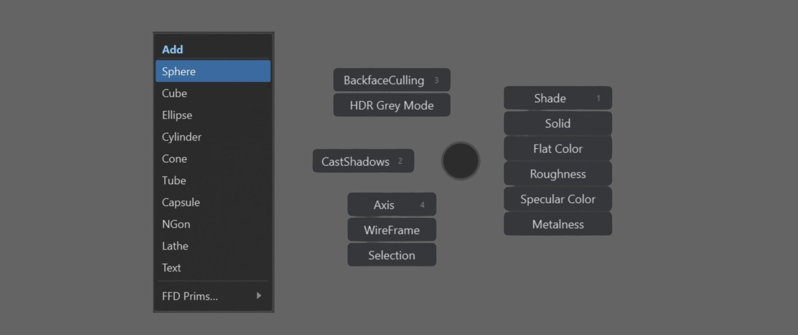
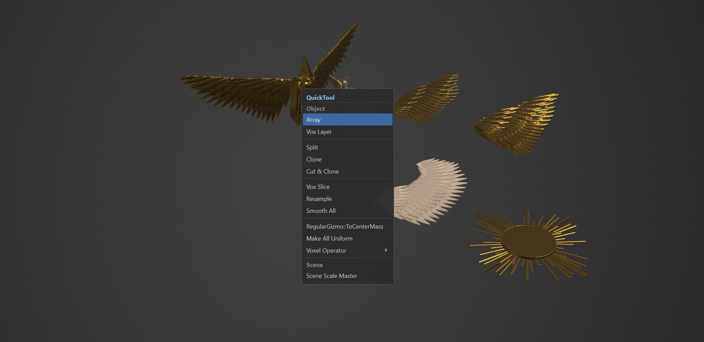
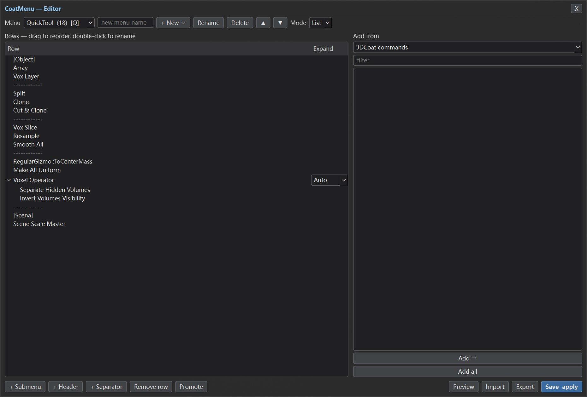

# CoatMenu

> Custom pop-up action menus for **3D-Coat** — at the cursor, from a hotkey.

CoatMenu is inspired by [Krita **MenuBelt**](https://github.com/VictoryLuode/Krita-Menubelt),
the menu plug-in I built for Krita earlier: you build your own menus out of 3D-Coat
commands, tools and scripts, then reach them from a frameless overlay that appears
where your cursor is.

Press the hotkey once: the menu appears and **stays** after you let the key go.
Click an entry to run it — in a pie you can also press its digit — or click
anywhere else / press `Esc` to close.

A **menu** is the thing you build. `List` and `Pie` are only the two forms it can
take.

## Demo

A menu opened as a list, and the same kind of menu as a radial pie — the wheel is
centred on the cursor, so every slot is the same distance away:





The editor — every menu is a row on the left, the command catalog on the right:



## Highlights

* **At the cursor** — a frameless, always-on-top overlay that never takes focus
  from 3D-Coat.
* **Blender-style interaction** — the menu opens on the hotkey and **stays** after
  you release it: `↑`/`↓` + `Enter` drive it, `1..9` run the N-th entry, `Esc`
  steps back out one level at a time (submenu → menu), right-click cancels, and
  entries fire on mouse *release*, so press-drag-release works like Blender's. A
  click away still reaches 3D-Coat.
* **Keys are 3D-Coat's business** — CoatMenu has nothing to do with hotkeys. Each
  menu becomes its own entry in `Scripts ▸ CoatMenu`; to give one a key, hover over
  it and press `END` (3D-Coat's own *"'END' - Define Hotkey"*). The only thing
  CoatMenu does with the hotkey file is *read* it, to know which key just opened a
  menu. An earlier version tried to hand out keys itself: it cannot work — a key
  only attaches to an entry added inside 3D-Coat's menu pass, and doing it from
  outside silently wiped bindings set by hand — so it was removed.
* **Several menus, each with its own entry** — each becomes its own entry in
  3D-Coat's `Scripts ▸ CoatMenu` list (and so in Preferences ▸ Hotkeys). A list
  hangs from the cursor; a **pie is centred on it**, Blender-style.
* **Rows *or* a pie** — pick per menu. The pie is laid out the way Blender's is:
  rounded buttons around a small centre ring, each showing its `1..9` shortcut, so
  you can hit the digit instead of aiming. The ring grows with the label widths
  (spacing is `2*R*sin(pi/N)`) so buttons can never overlap. Slots start **straight
  up** and go clockwise, so four slots land on up / right / down / left.
* **`Expand` per row** — a group row decides how it unfolds instead of leaving it to
  the child count: **Auto** (three children or fewer stack in the slot, more opens a
  panel), **Inline** (always draw them in the slot), **Panel** (always a separate
  panel).
* **`Position` per row** — pin a row to a compass point (`Top`, `Top right`, `Right`,
  … `Top left`) so a pie becomes muscle memory: Freeze always up, Smooth always down.
  The column only appears for pie menus. Rows left on `Auto` spread evenly, first one
  straight up.
* **Multi-step rows** — a row can fire several 3D-Coat commands in order, which is
  how primitives work ("neutralise the tool → open the primitive tool → pick the
  shape"). The bundled `Add` menu is built from exactly that.
* **Submenus**, nested, unfold on hover (with a grace timer so diagonal mouse
  moves don't close them); in a pie a short dwell opens them. **Promote** turns a
  submenu into a menu of its own.
* **Three lists on a first run** — `QuickTool`, `Add` and `Shade` (a pie), in that
  order: the working set of the person who wrote this, and nothing else installed
  by default. Every one of them is built against the 3D-Coat that is running: the
  primitives and the quick tool list are curated lists of **3D-Coat's own command
  ids**, and the shading pie takes its grouping from 3D-Coat's own names. An id this
  build does not define is dropped at build time (`English.xml`, 3D-Coat's own id
  table, is the authority), so no shipped row is ever a row that does nothing.
* **More lists to build on request** — `Modeling`, `Tools` (your `CustomTools`
  presets), `Common` (grouped like 3D-Coat's own main menu) and `Sculpt Ops` (71 of
  3D-Coat's object commands - the ones on the VoxTree right-click menu - in seven
  groups: Decimate, Density & Resample, Boolean, Merge & Clone, Hide/Show/Ghost,
  Object Tools, Autopo & Retopo) are **not** installed for you; `+ New ▸ Built-in
  lists` in the editor adds any of them, built for the 3D-Coat that is running.
  The names are 3D-Coat's own, and every id is looked up before it becomes a row
  (see below), so a command this build does not have is left out rather than shipped
  as a row that does nothing.
* **Independent** — no other extension is required, none is imported, and none of
  its code ships here. Everything CoatMenu ships lives under its own namespace,
  because `cExtensions` shares one interpreter: a generic top-level name would
  collide with a neighbour's (a sibling extension's `ui` package did exactly that
  once).
* **Editor** — add rows from three sources, with readable names:
  | Source | What it gives you |
  |---|---|
  | 3D-Coat commands | 3D-Coat's own menu definitions — **900+ commands** |
  | My tools | the tools from 3D-Coat's `CustomTools` panel |
  | Scripts | your own scripts (other extensions' internals are skipped) |
  Plus drag-to-reorder (a row dropped onto another becomes its group), a second and
  third column to set how each group unfolds and where each row sits in a pie,
  double-click to rename, multi-select, **Add all** (a whole section in one click),
  **undo/redo** (`Ctrl+Z`), import/export, save & apply, and a right-click row menu
  (duplicate, copy/move to another menu, insert below, promote, rename, delete).
  Menus themselves: `+ New` makes an empty one or puts a **built-in list** back
  (with `▲`/`▼` to order them, `Rename`, `Delete`).
* **Keyboard and wheel** — a long list caps its height and scrolls, so the last
  rows are always reachable.
* **Diagnostics built in** — the editor shows each menu's hotkey next to its name
  and flags two menus fighting over one key; `Scripts ▸ CoatMenu ▸
  CoatMenu_Doctor` writes a full report (paths, startup state, catalog sizes, rows
  and keys per menu, clashes, a tool-switch probe, leftover menu item files, log
  tail) to `data/doctor.txt`.
* **Never touches your hotkeys file** — `Options_Hotkeys.xml` is opened read-only,
  never written. The file is easy to corrupt and 3D-Coat itself has done it before.
* **Your menus are yours** — an update only ever adds a menu that is **missing**.
  Nothing already in your file is renamed, reordered, edited or dropped (a menu we
  shipped counts as yours the moment it is in there), a `menus.json` that cannot
  be parsed is left alone with a dated copy beside it instead of being replaced by a
  starter, and **a built-in list you delete stays deleted**: the config remembers
  the deletion, so the next update does not treat it as missing and add it back —
  and `+ New ▸ Built-in lists` in the editor puts one back when you want it,
  freshly built against the 3D-Coat that is running.
  Deleting things is limited to what an install wrote: `coatmenu/`,
  `actions/`, plus the retired top-level folders (`core/`, `ui/`, and `ported/` from
  the version that shipped another extension's sculpt actions there). The entries
  3D-Coat itself writes for menus that are gone are cleaned up with them.

## Install

**Requirements:** 3D-Coat 2025 (it ships its own Python 3.11 + PySide6 — nothing to
install). The installer itself only needs Python 3.8+, and it runs on 3D-Coat's own
interpreter when that can be found.

### Option 1 — the package file (two clicks, nothing to run)

1. Download `CoatMenu-<version>.3dcpack` from Releases.
2. In 3D-Coat: **Addons ▸ Install Extension** (older builds: **File ▸ Install
   extension**) and pick that file. 3D-Coat unpacks it into
   `Documents\3DCoat\UserPrefs\Scripts\cExtensions\CoatMenu\` and adds its own
   debug scaffolding (`.env`, `.vscode/`) the way it does for every extension.
3. **Windows ▸ Panels ▸ Extensions** → find `CoatMenu` → **Start**, or tick
   **Auto-Launch** to have it load with 3D-Coat from then on. A package can only add
   or replace *files*, so it cannot write that load line itself — the checkbox is
   3D-Coat's own switch for it.
4. Restart 3D-Coat once (the `Scripts ▸ CoatMenu` entries come from a menu file the
   extension writes on its first load).
5. Open **Scripts ▸ CoatMenu ▸ Show CoatMenu**.

This is the route with no archive to unzip, no Python and no `.cmd` for SmartScreen
to hold up. It is also the route that leaves everything else to you: no pruning of
what a previous version left behind, and no backup of your lists before an update.
Updating a copy that Option 2 installed? Use Option 2 for that update.

### Option 2 — the release zip and `install.cmd`

1. Download `CoatMenu-v<version>.zip` from Releases and unzip it anywhere.
2. Double-click `install\install.cmd` — it runs on 3D-Coat's own Python (any
   `python-*` folder inside 3D-Coat's data folder, whichever version it is), asks
   Windows where `Documents` is, and only falls back to the `py` launcher or a
   `python` on `PATH` after checking that the candidate actually runs. Nothing
   outside 3D-Coat's user folder is touched.
3. Restart 3D-Coat — or open **Windows ▸ Panels ▸ Extensions** and hit **Start** to
   avoid a restart.
4. Open **Scripts ▸ CoatMenu ▸ Show CoatMenu**.

### Binding a key

**Hover over the menu entry in `Scripts ▸ CoatMenu` and press `END`**, then press
the combination you want. That is 3D-Coat's own way of assigning a hotkey (its
hint text reads *"'END' - Define Hotkey"*) and it writes the binding itself.
CoatMenu only ever *reads* `Options_Hotkeys.xml`, to know which key opened a menu.

### Where 3D-Coat lives does not matter

Nothing here hard-codes a path:

| What | How it is found |
|---|---|
| 3D-Coat's user data | `coat.io.dataPath()` at runtime (checked for a `UserPrefs` folder, never assumed); the installer asks the registry where `Documents` is, then the usual spots (and OneDrive), and takes `--documents DIR` / `COATMENU_DOCUMENTS` |
| 3D-Coat's program folder | `coat.io.installPath()`, falling back to the path in the user folder's `executable.txt` |
| 3D-Coat's own Python | any `python-*` folder in its data folder; every candidate has to run before it is used |
| The extension itself | from its own location (inferred from `paths.py`) |

### Option 3 — from a checkout

1. Clone this repository (or unzip the release archive), then run the installer from
   the unzipped folder:

   ```
   install\install.cmd
   ```

   or, from any Python 3.8+ interpreter:

   ```
   python install\install.py
   ```

   It copies the extension to `Documents\3DCoat\UserPrefs\Scripts\cExtensions\CoatMenu\`,
   writes the menu item to `Scripts\ExtraMenuItems\CoatMenu.xml` and appends one
   line to `Scripts\cExtensions\startup.txt`. Each of those is backed up only when
   its content actually changes (the three most recent copies are kept). Nothing
   outside 3D-Coat's user folder is touched.
3. Restart 3D-Coat.
4. Open **Scripts ▸ CoatMenu ▸ Show CoatMenu** (or **Edit menus** to build yours).
5. Optional: in **Preferences ▸ Hotkeys**, bind a key to `Show CoatMenu` and to any
   `CoatMenu_<Menu>` entry.

Uninstall:

```
install\install.cmd --uninstall
```

Your `data/menus.json` is backed up next to the extension instead of being
deleted.

## How it works

* A `cExtension` loaded from `UserPrefs/Scripts/cExtensions/` pumps the Qt event
  loop once per frame — that is what keeps the overlay alive inside 3D-Coat's
  process.
* The overlay is a frameless, always-on-top `Qt.ToolTip` widget, never a normal
  window: no title bar, no taskbar entry, and it never takes focus away from
  3D-Coat.
* Keyboard is read with `GetAsyncKeyState` polling instead of `grabKeyboard()`, so
  3D-Coat keeps receiving its own keys.
* Entries run through `coat.ui.cmd("$CommandID")`; script entries go through
  `coat.io.executeScript`.
* Every menu gets a **generated launcher script**
  (`actions/menus/CoatMenu_<Menu>.py`), because a 3D-Coat menu item points at a
  file and one file cannot know which menu it belongs to. The three fixed entries
  (Show CoatMenu / Edit menus / Diagnostics) live in
  `Scripts/ExtraMenuItems/CoatMenu.xml`, which 3D-Coat reads at startup; the
  one-per-menu entries are registered at runtime with `coat.ui.insertInMenu`, so a
  menu built in the editor is usable without a restart. Writing them in both places
  would list every menu twice.
* 3D-Coat writes its **own** `ExtraMenuItems/<id>.xml` for every entry it is asked
  to insert, and never removes one - so a menu deleted in the editor used to stay in
  the Scripts list forever. Launching the extension (or running an install) deletes
  the copies whose menu is gone and takes those ids out of the running 3D-Coat; the
  three fixed entries are only ever in `CoatMenu.xml`, never inserted as well.
* Your menus live in `<ext>/data/menus.json`.
* The bundled lists are built from **3D-Coat's own data** at the moment they are
  made — its `cTemplates` menu files, its `English.xml` id table, your
  `CustomTools` — and every id in a curated list is looked up in that id table
  first, so a row is always something this build of 3D-Coat actually has.
* The command catalog is cached for the session, so switching source in the editor
  is instant (3D-Coat's 7711-entry translation table is parsed once).

## Roadmap

| Stage | Content |
|---|---|
| ✔ M1 | extension skeleton, cursor overlay, linear menu, click/hold/`Esc`, installer, tests |
| ✔ M2 | `data/menus.json`, several menus + submenus, editor (sources, drag-and-drop, import/export), generated launchers |
| ✔ M3 | radial pie renderer (same data), dwell submenus, per-menu list/pie switch |
| ✔ M4 | Blender-style interaction, live preview, tools/script sources, conflict detection, doctor report |
| ✔ M5 | packaging and polish: one-command release zip, changelog, README |
| ✔ M6 | per-row `Expand` and `Position`, a bundled `Sculpt Ops` list, independence from other extensions |

A screen-edge menu belt was considered and dropped — the overlay-at-the-cursor
idea covers the same ground with less to hit by accident.

## Tests

```
bash tests/run_tests.sh
```

Runs offscreen (no 3D-Coat needed) with 3D-Coat's bundled Python. Suites:

| Suite | Covers |
|---|---|
| `test_catalog.py` | command/menu/hotkey/script parsing, readable names, key-code mapping |
| `test_config.py` | menu model, JSON round trip (including `expand` / `position`), launcher + menu-XML generation, stale cleanup |
| `test_popup.py` | layout, hit testing, hover, click-to-run, release-to-run, `Esc`, submenus, pie geometry (drawn = hit), centring, slot direction and pinned positions, forced inline/panel |
| `test_editor.py` | view↔model round trip, menu ops, catalog sources, Add all, undo/redo, save & reload, the `Expand` and `Position` columns, dragged-in groups keeping their children |
| `test_extension.py` | registration, per-frame hooks, one-frame module-cache clear |
| `test_install.py` | install/reinstall/uninstall into a throwaway tree — including that your own menus, folders and scripts survive an update, the retired `ported/` tree is cleaned up whole, and a config it cannot read is left byte-for-byte alone |
| `test_installed_copy.py` | the copy actually installed under `Documents/3DCoat` |
| `test_pack.py` | the `.3dcpack` artifact: it carries exactly the file set an install copies (no config, no menu XML, no generated launchers), stays inside the extension's own folder, and extracting it reproduces the installed tree |
| `test_verify.py` | whole-tree health: every module imports, every referenced name resolves, the built-in menus build, and the installer runs |

`tests/render_preview.py` renders the overlay and editor against the real data on
the machine and writes the PNGs used above. `tools/make_release.py` builds both
release artifacts (the zip and the `.3dcpack`).

## License

GPL-3.0. See [LICENSE](LICENSE).
