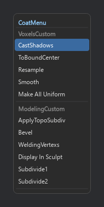
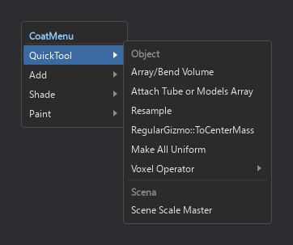
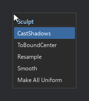
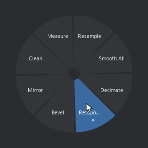
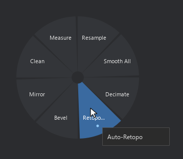
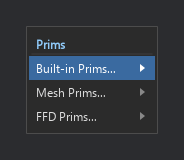
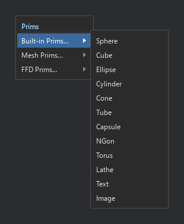
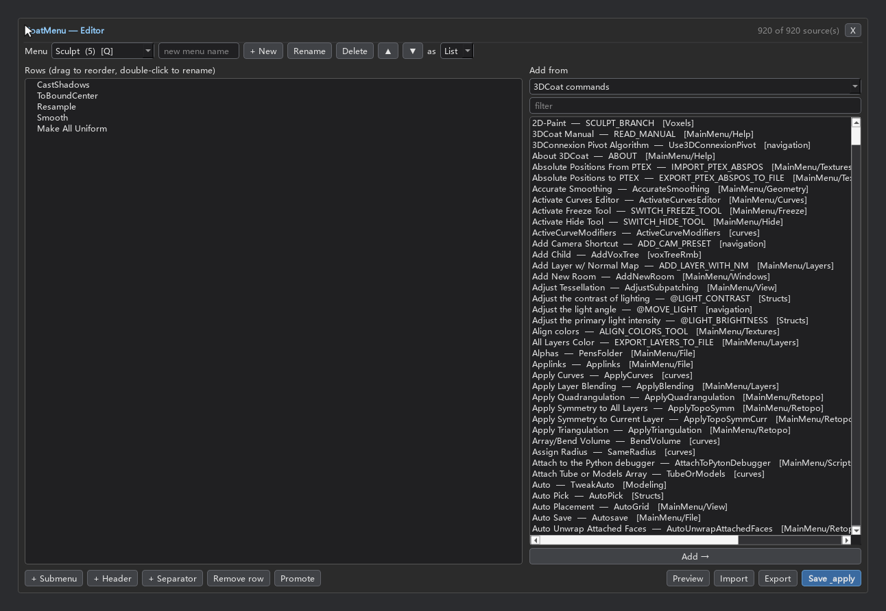

# CoatMenu

> Custom pop-up action menus for **3D-Coat** — at the cursor, from a hotkey.

CoatMenu is the 3D-Coat sibling of [Krita **MenuBelt**](https://github.com/VictoryLuode/Krita-Menubelt):
you build your own lists of 3D-Coat commands and scripts, then reach them from a
frameless overlay that appears where your cursor is.

Hold the hotkey, move to the entry you want, release — it runs.
`Esc` cancels. Clicking works too, if you prefer the mouse.

> **Status: M3.** Multiple lists, submenus, per-list hotkeys, a drag-and-drop
> editor and a radial **pie** renderer are in.

## Demo

Index (one row per list), a list opened as a submenu, and a single list flat:





The same list as a radial pie — the highlighted segment carries the accent dot
that marks a submenu (rest on it for a moment and the child panel unfolds):




The `Prims` list (ported from the LKS add-on's Add-Prims menu) and its
built-in shapes:




The editor:



*(previews rendered offscreen from real 3D-Coat data — the same lists the
extension builds on this machine)*

## Highlights

* **Rows at the cursor** — a frameless, always-on-top overlay that never takes
  focus from 3D-Coat.
* **Hold, move, release** — bind a hotkey and it runs the row you are pointing
  at when you let go. `Esc` cancels. Clicking works too.
* **Multiple lists, each with its own hotkey** — `Sculpt`, `Paint`, whatever you
  want; each becomes its own entry in 3D-Coat's menu (and so in
  Preferences ▸ Hotkeys).
* **Rows *or* a pie** — each list opens as a vertical list or as a radial pie
  (pick per list in the editor). The pie follows Blender's geometry: wedges run
  from the rim to a 12px dead zone (`pie_menu_threshold`), no centre disc, no
  centre caption — so you can sweep-and-release without reading, which is the
  point of a marking menu.
* **Multi-step rows** — a row can fire several 3DCoat commands in order, which
  is how primitives work ("neutralise the tool → open the primitive tool → pick
  the shape"). The bundled `Prims` list is a port of the LKS add-on's Add-Prims
  menu built from exactly that.
* **Submenus** — a row (or wedge) can open a child panel (nested, hover to open,
  grace timer so diagonal mouse moves don't close it; in a pie a short dwell
  unfolds it).
* **Built-in editor** — add rows from 3D-Coat's own command catalog
  (3D-Coat's own menu definitions → **900+ commands**, hotkey ids, `CustomMenu`
  entries, tool presets, scripts), with readable names taken from `English.xml`;
  drag to reorder, double-click to rename, nest submenus, import/export, save &
  apply.
* **Shared list format** — the same JSON shape as Krita
  [MenuBelt](https://github.com/VictoryLuode/Krita-MenuBelt), so lists move
  between the two add-ons.
* **Never touches your hotkeys file** — `Options_Hotkeys.xml` is read-only.

## Install

**Requirements:** 3D-Coat 2025 (ships its own Python 3.11 + PySide6 — nothing to
install).

1. Clone or unzip this repository.
2. Run the installer:

   ```
   install\install.cmd
   ```

   or, from any Python 3.8+ interpreter:

   ```
   python install\install.py
   ```

   It copies the extension to `Documents\3DCoat\UserPrefs\Scripts\cExtensions\CoatMenu\`,
   writes the menu item to `Scripts\ExtraMenuItems\CoatMenu.xml` and appends one
   line to `Scripts\cExtensions\startup.txt` (the previous file is backed up
   first). Nothing outside 3D-Coat's user folder is touched.
3. Restart 3D-Coat.
4. Open **Scripts ▸ CoatMenu ▸ Show CoatMenu**.
5. Optional: bind a key to that item in **Preferences ▸ Hotkeys**. With a key
   bound, the overlay supports *hold to open, release to run*.

Uninstall:

```
install\install.cmd --uninstall
```

## How it works

* A `cExtension` loaded from `UserPrefs/Scripts/cExtensions/` pumps the Qt event
  loop once per frame — that is what keeps the overlay alive inside 3D-Coat's
  process.
* The overlay is a frameless, always-on-top `Qt.ToolTip` widget, never a normal
  window: no title bar, no taskbar entry, and it never takes focus away from
  3D-Coat.
* Keyboard is read with `GetAsyncKeyState` polling instead of `grabKeyboard()`,
  so 3D-Coat keeps receiving its own keys.
* Entries run through `coat.ui.cmd("$CommandID")`; script entries go through
  `coat.io.executeScript`.
* Every list gets a **generated launcher script** (`actions/lists/<slug>.py`) plus
  a menu item in `Scripts/ExtraMenuItems/CoatMenu.xml`, because a 3D-Coat menu item
  points at a file and one file cannot know which list it belongs to. Saving in the
  editor also calls `coat.ui.insertInMenu` so the new items exist right away.
* Your lists live in `<ext>/data/lists.json`; uninstalling backs that file up
  instead of deleting it.
* `Preferences/Options_Hotkeys.xml` is **read only** — CoatMenu never writes to
  it (that file is easy to corrupt).

## Roadmap

| Stage | Content |
|---|---|
| ✔ M1 | extension skeleton, cursor overlay, linear list, click/hold/`Esc`, installer, tests |
| ✔ M2 | `data/lists.json`, multi-list + per-list hotkeys, submenus, built-in editor (sources, drag-and-drop, import/export), generated launchers |
| ✔ M3 | radial pie renderer (same data), dwell submenus, per-list list/pie switch |
| M4 | conflict detection, live preview, packaging, README polish |

## Tests

```
bash tests/run_tests.sh
```

Runs offscreen (no 3D-Coat needed) with 3D-Coat's bundled Python. Suites:

| Suite | Covers |
|---|---|
| `test_catalog.py` | hotkey/`CustomMenu`/script parsing, key-code mapping, trigger-key lookup |
| `test_config.py` | list model, JSON round trip, launcher + menu-XML generation, stale cleanup |
| `test_popup.py` | layout, hit testing, hover, click-to-run, trigger release, `Esc`, submenus, pie geometry (drawn = hit) |
| `test_editor.py` | view↔model round trip, list ops, source catalog, save & reload |
| `test_extension.py` | registration, per-frame hooks, one-frame module-cache clear |
| `test_install.py` | install/reinstall/uninstall into a throwaway tree (other extensions untouched) |

`tests/render_preview.py` renders the overlay and editor against the real data on
the machine and writes the PNGs used above.

## License

GPL-3.0. See [LICENSE](LICENSE).
